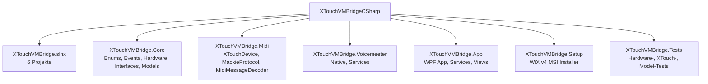

[English](README.md) | [Deutsch](README-DE.md)

# XTouchVMBridge (C#)

Windows-Anwendung zur Steuerung von Voicemeeter Potato via Behringer X-Touch (Full / Extender).
System-Tray-App mit Audio-Device-Monitoring und Screen-Lock-Schutz.

Portiert vom originalen Python-Projekt in ein C# .NET 8 Projekt.


## Voraussetzungen

- .NET 8 SDK (oder neuer)
- Windows 10/11
- Voicemeeter Potato (installiert, `VoicemeeterRemote64.dll` muss im Systempfad sein)
- Behringer X-Touch oder X-Touch Extender
  - Pflicht: Das Geraet muss per USB verbunden und vor App-Start im MC-Modus (Mackie Control) sein.
  - Hinweis: X-Touch Extender ist aktuell ungetestet.
  - Hinweis: Die PanelView (`X-Touch Panel`) ist aktuell nur für den X-Touch (Full-Size) ausgelegt.

## Build & Start

```bash
cd XTouchVMBridgeCSharp
dotnet build XTouchVMBridge.slnx
dotnet run --project XTouchVMBridge.App
```

## Tests

```bash
dotnet test XTouchVMBridge.Tests
```

Aktuell 107 Tests: Hardware-Controls, EncoderFunction/CycleLogic, MackieProtocol, MidiMessageDecoder, XTouchChannel-Model sowie Recorder-Dateinamen, Mute-LED-Policy und Config-Migration.

## Installer (MSI)

Es gibt jetzt ein WiX v4 Setup-Projekt fuer einen MSI-Installer:

```bash
dotnet build XTouchVMBridge.Setup/XTouchVMBridge.Setup.wixproj -c Release
```
oder als gehaerteter Release-Build:
```bash
powershell -ExecutionPolicy Bypass -File scripts/build-release.ps1
```

Ausgabe:

- `XTouchVMBridge.Setup/bin/x64/Release/XTouchVMBridge.Setup.msi`

Hinweise:

- Das Setup publisht die App automatisch und harvestet die Dateien fuer MSI.
- Startmenu-Verknuepfung ist enthalten.
- Desktop-Verknuepfung ist aktuell nicht enthalten (saubere ICE-Validierung fuer per-machine Install).
- `scripts/build-release.ps1` fuehrt Restore/Tests/Build aus und erstellt:
  - MSI in `artifacts/release/<Configuration>/`
  - Publish-ZIP (`XTouchVMBridge-win-x64.zip`)
  - `SHA256SUMS.txt` mit Pruefsummen zur Integritaetspruefung

## CI / GitHub Release

- Workflow: `.github/workflows/build-and-release.yml`
- Trigger:
  - Pull Requests: Build + Tests + MSI/ZIP/Checksums als Artifact
  - `main`: Build + Tests + MSI/ZIP/Checksums als Artifact
  - Tag `v*` (z. B. `v1.0.0`): Build + Tests + GitHub Release mit Dateianhaengen
- Erzeugte Release-Dateien:
  - `XTouchVMBridge.Setup.msi`
  - `XTouchVMBridge-win-x64.zip`
  - `SHA256SUMS.txt`
- Hinweis: Releases sind aktuell **nicht code-signiert** (Hobbyprojekt). Windows-SmartScreen-Warnungen sind moeglich.

## Release-Checklist

1. Realgeraete-Smoke-Test ausfuehren (X-Touch + Voicemeeter + MQTT-Basis-Mappings).
2. `dotnet test XTouchVMBridge.Tests` ausfuehren.
3. `powershell -ExecutionPolicy Bypass -File scripts/build-release.ps1` ausfuehren.
4. `SHA256SUMS.txt` gegen MSI/ZIP pruefen.
5. Tag `vX.Y.Z` erstellen und pushen.
6. GitHub-Release-Assets und Release-Notes pruefen.

Hash-Pruefbeispiel:
```powershell
Get-FileHash .\XTouchVMBridge.Setup.msi -Algorithm SHA256
Get-FileHash .\XTouchVMBridge-win-x64.zip -Algorithm SHA256
Get-Content .\SHA256SUMS.txt
```

## Solution-Struktur

## Konfiguration

Beim ersten Start wird `config.json` erzeugt. Darin werden pro Kanal (0-15) Name, Typ und Farbe definiert:

```json
{
  "configVersion": 1,
  "voicemeeterApiType": "potato",
  "enableXTouch": true,
  "segmentDisplayCycleButton": 52,
  "channels": {
    "0": { "name": "WaveMIC", "type": "Hardware Input 1", "color": "green" },
    "1": { "name": "RiftMIC", "type": "Hardware Input 2", "color": "green" },
    ...
  },
  "masterButtonActions": {
    "54": { "actionType": "LaunchProgram", "programPath": "notepad.exe" },
    "55": { "actionType": "SendKeys", "keyCombination": "Ctrl+Shift+M" },
    "56": { "actionType": "SendText", "text": "Hallo Welt" },
    "91": { "actionType": "SendKeys", "keyCombination": "MediaPrev" },
    "92": { "actionType": "SendKeys", "keyCombination": "MediaNext" },
    "93": { "actionType": "SendKeys", "keyCombination": "MediaStop" },
    "94": { "actionType": "SendKeys", "keyCombination": "MediaPlay" }
  }
}
```

- Kanalnamen: max. 7 Zeichen (ASCII), werden auf dem X-Touch LCD angezeigt
- Farben: `off`, `red`, `green`, `yellow`, `blue`, `magenta`, `cyan`, `white`
- Kanäle 0-7: Voicemeeter Input Strips
- Kanäle 8-15: Voicemeeter Output Buses

## Dokumentation

- [ARCHITECTURE-DE.md](docs/ARCHITECTURE-DE.md) -- Projektstruktur, DI, Design Patterns, Erweiterbarkeit
- [VOICEMEETER-API-DE.md](docs/VOICEMEETER-API-DE.md) -- Vollstandige Voicemeeter Remote API Parameter-Referenz (implementiert + erweiterbar)
- [MIGRATION-DE.md](docs/MIGRATION-DE.md) -- Zuordnung Python-Original zu C#-Implementierung
- [MQTT-DE.md](docs/MQTT-DE.md) -- MQTT Setup, Topic-Schema, Master Device Select + Transport
- [RELEASE-DE.md](docs/RELEASE-DE.md) -- Neuer Setup-Build, Tagging und GitHub Release Workflow

## Security-Hinweis (aktueller Scope)

- MQTT-Zugangsdaten liegen aktuell im Klartext in der `config.json`.
- `allowUntrustedCertificates` kann fuer lokale/vertraute Netze aktiviert werden, ist in unsicheren Umgebungen aber nicht empfohlen.
- Fuer den vorgesehenen Einsatzzweck (trusted local setup) wird das fuer `v1.0` bewusst akzeptiert.

## Features

- **X-Touch (Full)**: 8 Kanalstreifen + Main Fader + Master Section (Transport, Encoder Assign, Function, Jog Wheel, etc.)
- **Fader, Buttons, Encoder**: Rec/Solo/Mute/Select, motorisierte Fader, LCD-Displays, Level-Meter
- **Encoder-Funktionsliste**: Jeder Encoder kann mehrere Funktionen haben (z.B. HIGH/MID/LOW EQ, PAN, GAIN).
  Drücken schaltet zyklisch durch die Funktionsliste, Drehen ändert den Wert der aktiven Funktion.
  Aktuelle Funktion und Wert werden im Display und auf dem Encoder-Knob angezeigt.
- **Voicemeeter Bridge**: Echtzeit-Steuerung von Gain, Mute, Solo; Level-Meter-Feedback
- **Kanal-Ansichten**: Home / Outputs / Inputs, umschaltbar per FLIIP Buttom
- **Audio-Device-Monitor**: Erkennt USB-Geräteänderungen, startet Voicemeeter neu
- **Screen-Lock-Schutz**: Blockiert X-Touch-Eingabe bei gesperrtem Bildschirm
- **MIDI Debug Monitor**: Echtzeit-Anzeige aller MIDI-Nachrichten (Tray-Menu)
- **X-Touch Panel**: Interaktive visuelle Darstellung der X-Touch Oberfläche (Tray-Menu).
  Zeigt alle Controls in Echtzeit, Klick auf ein Control zeigt MIDI-Details und zugeordnete Funktion.
  Die Master-Button-Darstellung spiegelt jetzt den tatsächlich auf dem Gerät gesetzten LED-Zustand.
  - **Strg+Klick auf Master-Buttons**: Führt die konfigurierte Aktion aus (z.B. Media-Keys).
    Ohne konfigurierte Aktion wird die LED getoggelt (On/Off) und die MIDI-Note ans X-Touch gesendet.
  - **Strg+Klick auf Kanal-Buttons** (REC/SOLO/MUTE/SELECT): Toggelt den zugeordneten Voicemeeter-Parameter.
    Nicht-zugewiesene Buttons toggeln ihre LED direkt (On/Off).
    Bei aktivem Solo blinken die MUTE-LEDs der nicht-solo Strips (VM-Solo-Mute-Status).
    Bei REC-Spezialaktion `Aufnahme Start/Stop (Dateiname: Kanal + Zeit)` startet der erste Druck,
    der zweite Druck stoppt die Aufnahme; die LED folgt dem Recorder-Status.
  - **MQTT-Button-Mapping im Editor**: pro Kanal-Button zwischen VM-Parameter und MQTT Publish umschaltbar,
    inkl. `Test Publish` und `Test LED` (MQTT-LED-Option nur bei `MQTT Publish` sichtbar).
  - **Strg+Klick auf Encoder**: Schaltet durch die Funktionsliste (z.B. HIGH → MID → LOW → PAN → GAIN).
  - **Mausrad auf Encoder**: Ändert den Wert der aktiven Funktion. Strg+Mausrad = 5× gröbere Schritte.
  - **Strg+Klick auf Fader**: Fader per Mausbewegung steuern (Drag), Wert wird in Echtzeit an Voicemeeter gesendet.
- **Per-View Display-Farben**: Jede Channel View kann eigene Display-Farben pro Strip definieren,
  die die globale Kanalfarbe überschreiben. Konfigurierbar im Channel View Editor.
- **Log-Fenster**: Rolling-Log mit Level-Filter (Tray-Menu / Doppelklick)
- **X-Touch Geräteauswahl**: Unterstützung für X-Touch und X-Touch Extender, wählbar im Tray-Menu
- **Auto-Reconnect**: Automatische Wiederverbindung bei Gerätetrennung (alle 5 Sekunden)
- **Verbindungsstatus**: Anzeige im Tray-Tooltip und Kontextmenü ("X-Touch: Verbunden/Getrennt")
- **Sprachumschaltung**: Deutsch/Englisch kann im Tray-Menue gewechselt werden.
- **MQTT**:
  - Globaler MQTT-Client mit Config-Dialog
  - Channel-Button Mapping: VM-Parameter oder MQTT Publish
  - MQTT LED-Steuerung für Channel-Buttons und Master-Buttons (nur bei Aktionstyp `MQTT Publish`)
  - Mapping-Editor: `Test Publish` und `Test LED`
- **Master-Button-Aktionen**: F1-F8 und andere Master-Buttons können konfiguriert werden für:
  - Windows-Programme starten (mit Argumenten)
    Optional: LED anlassen, solange das konfigurierte Programm läuft
  - Tastenkombinationen senden (z.B. Ctrl+Shift+M, Alt+F4)
  - Media-Keys senden (MediaPlay, MediaNext, MediaPrev, MediaStop)
  - Text senden (via Zwischenablage + Ctrl+V)
  - Voicemeeter-Parameter toggeln
  - VM Audio Engine neu starten
  - VM-Fenster anzeigen (in den Vordergrund bringen)
  - VM-GUI sperren/entsperren (Toggle)
  - Voicemeeter Macro-Button auslösen (Index 0–79)
  - MQTT Publish (Topic, Payload Press/Release, QoS, Retain)
  - MQTT Gerät auswählen (DeviceId + CommandTopic)
  - MQTT Transport zum aktiven Gerät (play/pause/stop/next/prev/play_pause)
  - Für `VmParameter`: LED-Quelle wählbar (`ManualFeedback` oder `VoicemeeterState`)
- **LED-Feedback**: Jede Master-Button-Aktion hat einen konfigurierbaren LED-Modus:
  - **Blink**: LED blinkt kurz (150ms) als Bestätigung
  - **Toggle**: LED wechselt bei jedem Druck zwischen An und Aus
  - **Blinking**: LED blinkt dauerhaft (Hardware-Blink via Mackie Protocol), erneutes Drücken stoppt das Blinken
  - Für `LaunchProgram` kann die LED optional anbleiben, solange der gestartete Prozess läuft.
    Beim App-Start werden bereits laufende Programme über den konfigurierten EXE-Pfad erneut erkannt, mit Fallback auf den Prozessnamen.
- **7-Segment-Display**: Timecode-Anzeige zeigt Uhrzeit, Datum oder Speicherverbrauch.
  Cycle-Button (konfigurierbar, Standard: Note 52 / NAME) schaltet zwischen Modi um.

## MIDI Debug Monitor

Öffnet sich über das Tray-Menü unter "MIDI Debug Monitor". Zeigt alle ein- und ausgehenden MIDI-Nachrichten des X-Touch in Echtzeit an.

Jede Nachricht wird anhand der Behringer X-Touch MIDI-Dokumentation dekodiert und zeigt:
- Zeitstempel, Richtung (IN/OUT), Control-Typ, Kanal/ID, Wert, resultierende Aktion, rohe Hex-Bytes

Filter: Richtung (IN/OUT/SysEx), Control-Typ, Kanal 1-8.

Siehe auch: `Document_BE_X-TOUCH-X-TOUCH-EXTENDER-MIDI-Mode-Implementation.pdf` im Projektordner.

## X-Touch Panel

Interaktive visuelle Darstellung der vollständigen X-Touch Oberfläche, erreichbar via Tray-Menu "X-Touch Panel":

- **Links**: 8 Kanalstreifen (LCD, Encoder + Ring, REC/SOLO/MUTE/SELECT, Fader, Level-Meter, Touch) + Main Fader
- **Rechts**: Master Section (Encoder Assign, Display/Assignment, Global View, Function F1-F8,
  Modify/Automation/Utility, Transport mit Rewind/Forward/Stop/Play/Record, Fader Bank/Channel Navigation, Jog Wheel)
- **Echtzeit-Updates**: 100ms Timer + Events vom MIDI-Device
- **Master-LED-Spiegelung**: Master-Buttons im Panel verwenden den aktuellen Hardware-LED-Zustand statt eines panel-lokalen Schattenzustands
- **Klick-Detail**: Jedes Control zeigt im Detail-Panel: aktueller Zustand, Encoder-Funktionsliste mit
  aktivem Modus (z.B. ">HIGH = 3.5dB"), MIDI-Protokoll-Details, Hersteller-Doku-Referenzen
- **Strg+Klick-Steuerung**: Alle Controls können per Strg+Klick direkt bedient werden:
  - Master-Buttons: konfigurierte Aktion ausführen, oder LED toggeln (On/Off)
  - Kanal-Buttons (REC/SOLO/MUTE/SELECT): zugeordneten VM-Parameter toggeln, oder LED toggeln bei nicht-zugewiesenen Buttons
  - Encoder: durch zugewiesene Funktionen cyclen (HIGH → MID → LOW → PAN → GAIN → ...)
  - Fader: per Maus-Drag steuern (transparentes Overlay über dem deaktivierten Slider)
- **Mausrad-Steuerung** auf Encodern: Wert der aktiven Funktion ändern, Strg+Mausrad für 5× gröbere Schritte

## Channel View Editor

Channel Views können im X-Touch Panel über den Mapping-Editor bearbeitet werden.
Pro View werden 8 Voicemeeter-Kanäle auf die physischen X-Touch-Strips gemappt.

- **Kanal-Zuordnung**: Jeder Strip kann einem beliebigen VM-Kanal (0-15) zugewiesen werden
- **Display-Farben**: Pro Strip kann eine eigene Display-Farbe festgelegt werden,
  die die globale Kanalfarbe überschreibt. Verfügbare Farben: Off, Red, Green, Yellow, Blue, Magenta, Cyan, White.
  Wird keine Farbe gesetzt ("—"), gilt die globale Kanalfarbe.

In der `config.json` unter `channelViews`:

```json
"channelViews": [
  {
    "name": "Home",
    "channels": [3, 4, 5, 6, 7, 9, 10, 12],
    "channelColors": ["green", "green", "cyan", "cyan", "cyan", "yellow", "yellow", "magenta"]
  },
  {
    "name": "Outputs",
    "channels": [8, 9, 10, 11, 12, 13, 14, 15],
    "channelColors": null
  }
]
```

`channelColors`: Array mit 8 Einträgen (je Strip) oder `null` für globale Farben.
Einzelne Einträge können `null` sein um die globale Farbe für diesen Strip beizubehalten.

## Encoder-Funktionsliste

Die Encoder (Drehregler) unterstützen eine konfigurierbare Liste von Funktionen pro Kanal.
Standardmäßig sind für Encoder 2, 4-8 folgende Funktionen registriert:

| Funktion | Parameter | Bereich | Schrittweite |
|---|---|---|---|
| HIGH | EQGain3 | -12..+12 dB | 0.5 dB |
| MID | EQGain2 | -12..+12 dB | 0.5 dB |
| LOW | EQGain1 | -12..+12 dB | 0.5 dB |
| PAN | Pan_x | -0.5..+0.5 | 0.05 |
| GAIN | Gain | -60..+12 dB | 0.5 dB |

- **Drücken** (Hardware): Schaltet zur nächsten Funktion (HIGH → MID → LOW → PAN → GAIN → HIGH ...)
- **Drehen** (Hardware): Ändert den Wert der aktiven Funktion
- **Strg+Klick** (Panel): Schaltet zur nächsten Funktion (identisch mit Hardware-Drücken)
- **Mausrad** (Panel): Ändert den Wert der aktiven Funktion (±1 Step pro Notch)
- **Strg+Mausrad** (Panel): Grobe Steuerung (±5 Steps pro Notch)
- **Display**: Zeigt kurzzeitig den neuen Funktionsnamen, dann den Wert, dann ">FUNKTIONSNAME"
- **Encoder-Ring**: Position zeigt den aktuellen Wert relativ zum Bereich (0-10 LEDs)

Encoder 1 bleibt für Ansichtswechsel, Encoder 3 für Shortcut-Modus.

## Master-Button-Aktionen

Die Master-Section-Buttons (F1-F8, Transport, Utility, etc.) können im X-Touch Panel mit
benutzerdefinierten Aktionen belegt werden. Klick auf einen Master-Button im Panel zeigt den
Mapping-Editor mit folgenden Aktionstypen:

| Aktionstyp | Beschreibung | Konfigurationsfelder |
|---|---|---|
| **VM-Parameter toggeln** | Bool-Parameter in Voicemeeter umschalten | VM-Parameter (z.B. `Strip[0].Mute`), optional `vmLedSource` (`ManualFeedback` / `VoicemeeterState`) |
| **Programm starten** | Windows-Programm ausführen | Programmpfad, optionale Argumente, optional LED anlassen solange der Prozess läuft |
| **Tastenkombination** | Keyboard-Shortcut simulieren | Kombination (z.B. `Ctrl+Shift+M`, `Alt+F4`, `F5`) |
| **Text senden** | Text via Zwischenablage einfügen | Beliebiger Text |
| **VM Audio Engine neu starten** | Voicemeeter Audio Engine restarten | — |
| **VM-Fenster anzeigen** | Voicemeeter in den Vordergrund bringen | — |
| **VM-GUI sperren/entsperren** | GUI-Lock toggeln | — |
| **Macro-Button auslösen** | Voicemeeter Macro-Button triggern | Macro-Button Index (0–79) |
| **MQTT Publish** | MQTT Nachricht beim Drücken/Loslassen senden | Topic, Payload Press/Release, QoS, Retain |
| **MQTT Gerät auswählen** | Aktives MQTT-Zielgerät wählen | DeviceId, CommandTopic |
| **MQTT Transport** | Transport-Befehl an aktives Zielgerät senden | Command, Payload-Override (optional), QoS, Retain |

Unterstützte Modifier: `Ctrl`, `Alt`, `Shift`, `Win`. Unterstützte Sondertasten: `F1`-`F24`,
`Enter`, `Escape`, `Tab`, `Space`, `Delete`, `Home`, `End`, `PageUp`, `PageDown`, Pfeiltasten,
`VolumeUp`, `VolumeDown`, `Mute`, `MediaPlay`, `MediaNext`, `MediaPrev`, `MediaStop`, etc.

In der `config.json` unter `masterButtonActions` (Key = MIDI Note-Nummer):

```json
"masterButtonActions": {
  "54": { "actionType": "LaunchProgram", "programPath": "C:\\Windows\\notepad.exe", "programArgs": "", "keepLedOnWhileProgramRuns": true, "ledFeedback": "Blink" },
  "55": { "actionType": "SendKeys", "keyCombination": "Ctrl+Shift+M", "ledFeedback": "Toggle" },
  "56": { "actionType": "SendText", "text": "Hallo Welt", "ledFeedback": "Blinking" },
  "57": { "actionType": "VmParameter", "vmParameter": "Strip[0].Mute", "vmLedSource": "VoicemeeterState" },
  "58": { "actionType": "RestartAudioEngine" },
  "59": { "actionType": "ShowVoicemeeter" },
  "60": { "actionType": "LockGui", "ledFeedback": "Toggle" },
  "61": { "actionType": "TriggerMacroButton", "macroButtonIndex": 0 },
  "84": { "actionType": "SelectMqttDevice", "mqttDeviceId": "deviceA", "mqttDeviceCommandTopic": "media/deviceA/cmd" },
  "85": { "actionType": "SelectMqttDevice", "mqttDeviceId": "deviceB", "mqttDeviceCommandTopic": "media/deviceB/cmd" },
  "91": { "actionType": "MqttTransport", "mqttTransportCommand": "prev", "mqttQos": 0 },
  "92": { "actionType": "MqttTransport", "mqttTransportCommand": "next", "mqttQos": 0 },
  "93": { "actionType": "MqttTransport", "mqttTransportCommand": "stop", "mqttQos": 0 },
  "94": { "actionType": "MqttTransport", "mqttTransportCommand": "play_pause", "mqttQos": 0 }
}
```

Note-Nummern für Function-Buttons: F1=54, F2=55, ..., F8=61.
Transport-Buttons: REW=91, FF=92, STOP=93, PLAY=94, REC=95.

### MQTT Device Select + Transport (ohne Home Assistant)

Mit den Aktionstypen `MQTT Gerät auswählen` und `MQTT Transport` kann die Master-Section zwei oder mehr Geräte direkt per MQTT steuern:

- **Selector-Buttons** (z.B. MARKER/NUDGE):
  - Aktionstyp `MQTT Gerät auswählen`
  - Felder: `DeviceId`, `CommandTopic`
  - Verhalten: nur ein Gerät ist aktiv; aktiver Selector leuchtet
- **Transport-Buttons** (z.B. REW/FF/STOP/PLAY):
  - Aktionstyp `MQTT Transport`
  - sendet den gewählten Command an das aktuell aktive Gerät
  - optionales Payload-Override; sonst wird der Command-Text als Payload gesendet

Preset-Commands im Editor für Transport-Buttons:
- Rewind (91) -> `prev`
- Forward (92) -> `next`
- Stop (93) -> `stop`
- Play (94) -> `play_pause`
- Record (95) -> `pause`

### LED-Feedback

Jede Aktion kann über `ledFeedback` bestimmen, wie die Button-LED reagiert:

| Modus | Beschreibung |
|---|---|
| `Blink` (Standard) | LED blinkt 150ms auf als Bestätigung |
| `Toggle` | LED wechselt bei jedem Druck: 1× drücken = an, 2× drücken = aus |
| `Blinking` | LED blinkt dauerhaft (Hardware-Blink via Mackie Protocol), erneutes Drücken stoppt das Blinken |

Der Toggle-Modus eignet sich besonders für Lock/Unlock-Aktionen oder um den aktiven Status
eines Programms visuell auf dem X-Touch darzustellen. Der Blinking-Modus nutzt den nativen
Hardware-Blink des Mackie-Protokolls (Velocity 2) und benötigt keine Software-Timer.

Für `VmParameter`-Aktionen kann optional `vmLedSource` gesetzt werden:
- `ManualFeedback` (Standard): LED folgt `ledFeedback`
- `VoicemeeterState`: LED folgt dem echten VM-Parameterzustand (On/Off), auch bei externen Änderungen in Voicemeeter

Für `LaunchProgram`-Aktionen kann optional `keepLedOnWhileProgramRuns` gesetzt werden:
- `false` (Standard): LED folgt dem normalen `ledFeedback`
- `true`: LED bleibt an, solange der konfigurierte Prozess läuft, und geht aus wenn der letzte passende Prozess endet
- Beim App-Start werden passende laufende Prozesse aus dem konfigurierten EXE-Pfad wiederhergestellt; falls der Prozesspfad nicht lesbar ist, wird auf EXE-/Prozessnamen zurückgefallen

Hinweis: `LED per MQTT steuern` im Master-Editor ist nur beim Aktionstyp `MQTT Publish` verfügbar.

### Media-Fernbedienung (z.B. YouTube in Vivaldi/Chrome)

Die Transport-Buttons können als Media-Keys konfiguriert werden, um Browser-Mediaplayer zu steuern:

```json
"masterButtonActions": {
  "91": { "actionType": "SendKeys", "keyCombination": "MediaPrev" },
  "92": { "actionType": "SendKeys", "keyCombination": "MediaNext" },
  "93": { "actionType": "SendKeys", "keyCombination": "MediaStop" },
  "94": { "actionType": "SendKeys", "keyCombination": "MediaPlay" }
}
```

Die Media-Keys werden vom Betriebssystem an den aktiven Mediaplayer weitergeleitet
(z.B. YouTube im Browser, Spotify, VLC).

## Letzte Updates

- Laufzeit-Lokalisierung verbessert: Panel und Dialoge wechseln nach Sprachwechsel konsistent.
- MSI-Paketierung: WiX-App-Dateien werden als AppFiles-Komponentengruppe generiert, um Linker-Fehler in CI-Builds zu vermeiden.

## 7-Segment-Display (Timecode-Anzeige)

Das 12-stellige 7-Segment-Display auf dem X-Touch zeigt standardmäßig die **Uhrzeit** an.
Per Cycle-Button (Standard: NAME/VALUE, Note 52) kann zwischen folgenden Modi gewechselt werden:

| Modus | Anzeige | Update-Intervall |
|---|---|---|
| **Time** (Standard) | `HH.MM.SS` | 500ms |
| **Date** | `dd.MM.YYYY` | 10s |
| **Memory** | Speicherverbrauch in MB | 2s |
| **Off** | Display leer | - |

Der Cycle-Button kann in der Config angepasst werden:

```json
"segmentDisplayCycleButton": 52
```

Standard ist Note 52 (NAME/VALUE Button). `0` = Cycle-Funktion deaktiviert.
Das Display kommuniziert über Behringer-eigene SysEx-Nachrichten
(`F0 00 20 32 dd 37 ...`) mit automatischer Device-ID-Erkennung (X-Touch=0x14, Ext=0x15).

## Credits & Danksagung

Dieses Projekt ist eine vollständige Neuentwicklung in C# / .NET 8, basierend auf dem originalen
Python-Projekt **audiomanager** von [TheRedNet](https://github.com/TheRedNet):

- **Original-Repository**: [github.com/TheRedNet/audiomanager](https://github.com/TheRedNet/audiomanager)
- **Original-Sprache**: Python (XTouchVM.py, XTouchLib.py, audiomanager.pyw)
- **Portierung**: C# / WPF / .NET 8 mit Claude Code (Anthropic)

Die Kernidee — Voicemeeter Potato über das Behringer X-Touch im Mackie Control Modus zu steuern —
stammt aus dem Python-Original. Die C#-Portierung erweitert das Konzept um eine modulare Architektur
mit Dependency Injection, umfangreiche Unit-Tests, eine grafische Oberfläche (WPF) mit interaktivem
X-Touch Panel, MIDI Debug Monitor und konfigurierbaren Master-Button-Aktionen.

