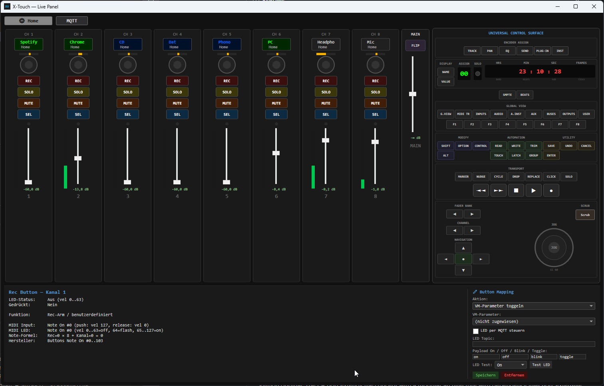
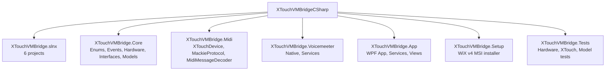

[English](README.md) | [Deutsch](README-DE.md)

# XTouchVMBridge (C#)

Windows application to control Voicemeeter Potato via Behringer X-Touch (Full / Extender).
System tray app with audio device monitoring and screen lock protection.

Ported from the original Python project to a C# .NET 8 project.



## Requirements

- .NET 8 SDK (or newer)
- Windows 10/11
- Voicemeeter Potato (installed, `VoicemeeterRemote64.dll` must be in the system path)
- Behringer X-Touch or X-Touch Extender (USB, in Mackie Control mode)
  - Note: X-Touch Extender support is currently untested.
  - Note: PanelView (`X-Touch Panel`) is currently designed for X-Touch (full-size) only.

## Build & Launch
```bash
cd XTouchVMBridgeCSharp
dotnet build XTouchVMBridge.slnx
dotnet run --project XTouchVMBridge.App
```
## Tests
```bash
dotnet test XTouchVMBridge.Tests
```
Currently 99 tests: Hardware controls, EncoderFunction/CycleLogic, MackieProtocol, MidiMessageDecoder, XTouchChannel model.

## Installer (MSI)

A WiX v4 setup project is now included for building an MSI installer:

```bash
dotnet build XTouchVMBridge.Setup/XTouchVMBridge.Setup.wixproj -c Release
```

Output:

- `XTouchVMBridge.Setup/bin/x64/Release/XTouchVMBridge.Setup.msi`

Notes:

- The setup project automatically publishes the app and harvests files for MSI packaging.
- A Start menu shortcut is included.
- A Desktop shortcut is currently not included (clean ICE validation for per-machine install).

## Solution structure

## Configuration

The first time it is started, `config.json` is created. The name, type and color are defined for each channel (0-15):
```json
{
  "voicemeeterApiType": "potato",
  "enableXTouch": true,
  "segmentDisplayCycleButton": 52,
  "channels": {
    "0": { "name": "WaveMIC", "type": "Hardware Input 1", "color": "green" },
    "1": { "name": "RiftMIC", "type": "Hardware Input 2", "color": "green" },
    ...
  },
  "masterButtonActions": {
    "54": { "actionType": "LaunchProgram", "programPath": "notepad.exe" },
    "55": { "actionType": "SendKeys", "keyCombination": "Ctrl+Shift+M" },
    "56": { "actionType": "SendText", "text": "Hallo Welt" },
    "91": { "actionType": "SendKeys", "keyCombination": "MediaPrev" },
    "92": { "actionType": "SendKeys", "keyCombination": "MediaNext" },
    "93": { "actionType": "SendKeys", "keyCombination": "MediaStop" },
    "94": { "actionType": "SendKeys", "keyCombination": "MediaPlay" }
  }
}
```
- Channel names: max. 7 characters (ASCII), displayed on the X-Touch LCD
- Colors: `off`, `red`, `green`, `yellow`, `blue`, `magenta`, `cyan`, `white`
- Channels 0-7: Voicemeeter input strips
- Channels 8-15: Voicemeeter Output Buses

## Documentation

- [ARCHITECTURE.md](docs/ARCHITECTURE.md) -- Project structure, DI, design patterns, extensibility
- [VOICEMEETER-API.md](docs/VOICEMEETER-API.md) -- Full Voicemeeter Remote API parameter reference (implemented + extensible)
- [MIGRATION.md](docs/MIGRATION.md) -- Mapping Python original to C# implementation
- [MQTT.md](docs/MQTT.md) -- MQTT Setup, Topic Schema, Master Device Select + Transport

##Features

- **X-Touch (Full)**: 8 channel strips + Main Fader + Master Section (Transport, Encoder Assign, Function, Jog Wheel, etc.)
- **Faders, Buttons, Encoders**: Rec/Solo/Mute/Select, motorized faders, LCD displays, level meters
- **Encoder function list**: Each encoder can have multiple functions (e.g. HIGH/MID/LOW EQ, PAN, GAIN).
  Pressing switches cyclically through the function list, turning changes the value of the active function.
  Current function and value are shown in the display and on the encoder knob.
- **Voicemeeter Bridge**: Real-time control of Gain, Mute, Solo; Level meter feedback
- **Channel views**: Home / Outputs / Inputs, switchable via FLIIP button
- **Audio Device Monitor**: Detects USB device changes, restarts Voicemeeter
- **Screen Lock Protection**: Blocks X-Touch input when the screen is locked
- **MIDI Debug Monitor**: Real-time display of all MIDI messages (tray menu)
- **X-Touch Panel**: Interactive visual representation of the X-Touch interface (tray menu).
  Shows all controls in real time, clicking on a control shows MIDI details and assigned function.
  - **Ctrl+click on master buttons**: Executes the configured action (e.g. media keys).
    Without a configured action, the LED is toggled (on/off) and the MIDI note is sent to the X-Touch.
  - **Ctrl+click on channel buttons** (REC/SOLO/MUTE/SELECT): Toggles the assigned Voicemeeter parameter.
    Unassigned buttons toggle their LED directly (On/Off).
  - **MQTT button mapping in the editor**: switchable between VM parameters and MQTT publish per channel button,
    including `Test Publish` and `Test LED`.
  - **Ctrl+click on encoder**: Switches through the function list (e.g. HIGH → MID → LOW → PAN → GAIN).
  - **Mouse wheel on encoder**: Changes the value of the active function. Ctrl+mouse wheel = 5× coarser steps.
  - **Ctrl+click on fader**: Control fader via mouse movement (drag), value is sent to Voicemeeter in real time.
- **Per-View Display Colors**: Each channel view can define its own display colors per strip,
  which override the global channel color. Configurable in the Channel View Editor.
- **Log window**: Rolling log with level filter (tray menu / double click)
- **X-Touch device selection**: Support for X-Touch and X-Touch Extender, selectable in the tray menu
- **Auto-Reconnect**: Automatic reconnection when device disconnects (every 5 seconds)
- **Connection status**: Display in tray tooltip and context menu ("X-Touch: Connected/Disconnected")
- **MQTT**:
  - Global MQTT client with config dialog
  - Channel button mapping: VM parameters or MQTT publish
- MQTT LED control for channel buttons and master buttons
  - Mapping editor: `Test Publish` and `Test LED`
- **Master Button Actions**: F1-F8 and other master buttons can be configured for:
  - Start Windows programs (with arguments)
  - Send key combinations (e.g. Ctrl+Shift+M, Alt+F4)
  - Send media keys (MediaPlay, MediaNext, MediaPrev, MediaStop)
  - Send text (via clipboard + Ctrl+V)
  - Toggle Voicemeeter parameters
  - Restart VM Audio Engine
  - Show VM window (bring to foreground)
  - Lock/Unlock VM GUI (Toggle)
  - Trigger Voicemeeter macro button (index 0-79)
  - MQTT Publish (Topic, Payload Press/Release, QoS, Retain)
  - Select MQTT device (DeviceId + CommandTopic)
  - MQTT transport to active device (play/pause/stop/next/prev/play_pause)
  - For `VmParameter`: LED source selectable (`ManualFeedback` or `VoicemeeterState`)
- **LED Feedback**: Each master button action has a configurable LED mode:
  - **Blink**: LED flashes briefly (150ms) as confirmation
  - **Toggle**: LED switches between on and off with each press
  - **Blinking**: LED flashes continuously (hardware flash via Mackie Protocol), pressing again stops flashing
- **7-segment display**: Timecode display shows time, date or memory usage.
  Cycle button (configurable, default: Note 52 / NAME) switches between modes.

## MIDI Debug Monitor

Opens via the tray menu under "MIDI Debug Monitor". Displays all incoming and outgoing MIDI messages from the X-Touch in real time.

Each message is decoded using the Behringer X-Touch MIDI documentation and shows:
- Timestamp, direction (IN/OUT), control type, channel/ID, value, resulting action, raw hex bytes

Filter: Direction (IN/OUT/SysEx), Control Type, Channel 1-8.

See also: `Document_BE_X-TOUCH-X-TOUCH-EXTENDER-MIDI-Mode-Implementation.pdf` in the project folder.

## X Touch Panel

Interactive visual representation of the complete X-Touch interface, accessible via the “X-Touch Panel” tray menu:

- **Left**: 8 channel strips (LCD, encoder + ring, REC/SOLO/MUTE/SELECT, fader, level meter, touch) + main fader
- **Right**: Master Section (Encoder Assign, Display/Assignment, Global View, Function F1-F8,
  Modify/Automation/Utility, Transport with Rewind/Forward/Stop/Play/Record, Fader Bank/Channel Navigation, Jog Wheel)
- **Real-time updates**: 100ms timer + events from MIDI device
- **Click Detail**: Each control shows in the detail panel: current status, encoder function list
  active mode (e.g. ">HIGH = 3.5dB"), MIDI protocol details, manufacturer documentation references
- **Ctrl+click control**: All controls can be operated directly via Ctrl+click:
  - Master buttons: execute configured action, or toggle LED (On/Off)
  - Channel buttons (REC/SOLO/MUTE/SELECT): toggle assigned VM parameters, or LED toggle for unassigned buttons
  - Encoder: cycle through assigned functions (HIGH → MID → LOW → PAN → GAIN → ...)
  - Fader: control via mouse drag (transparent overlay above the deactivated slider)
- **Mouse wheel control** on encoders: Change value of active function, Ctrl+mouse wheel for 5× coarser steps

## Channel View Editor

Channel views can be edited in the X-Touch panel using the mapping editor.
8 Voicemeeter channels are mapped to the physical X-Touch strips per view.

- **Channel Mapping**: Each strip can be assigned to any VM channel (0-15).
- **Display colors**: You can set your own display color for each strip,
  which overrides the global channel color. Available Colors: Off, Red, Green, Yellow, Blue, Magenta, Cyan, White.
  If no color is set ("—"), the global channel color applies.

In the `config.json` under `channelViews`:
```json
"channelViews": [
  {
    "name": "Home",
    "channels": [3, 4, 5, 6, 7, 9, 10, 12],
    "channelColors": ["green", "green", "cyan", "cyan", "cyan", "yellow", "yellow", "magenta"]
  },
  {
    "name": "Outputs",
    "channels": [8, 9, 10, 11, 12, 13, 14, 15],
    "channelColors": null
  }
]
```
`channelColors`: Array with 8 entries (per strip) or `null` for global colors.
Individual entries can be `null` to maintain the global color for that strip.

## Encoder function list

The encoders (knobs) support a configurable list of functions per channel.
By default, the following functions are registered for encoders 2, 4-8:

| Function | Parameters | Area | Step size |
|---|---|---|---|
| HIGH | EQGain3 | -12..+12 dB | 0.5dB |
| MID | EQGain2 | -12..+12 dB | 0.5dB |
| LOW | EQGain1 | -12..+12 dB | 0.5dB |
| PAN | Pan_x | -0.5..+0.5 | 0.05 |
| GAIN | Gain | -60..+12 dB | 0.5dB |

- **Press** (Hardware): Switches to the next function (HIGH → MID → LOW → PAN → GAIN → HIGH ...)
- **Rotate** (Hardware): Changes the value of the active function
- **Ctrl+Click** (Panel): Switches to the next function (identical to hardware pressing)
- **Mouse Wheel** (Panel): Changes the value of the active function (±1 step per notch)
- **Ctrl+Mouse Wheel** (Panel): Rough control (±5 steps per notch)
- **Display**: Briefly shows the new function name, then the value, then ">FUNCTION NAME"
- **Encoder ring**: Position shows the current value relative to the range (0-10 LEDs)

Encoder 1 remains for view switching, encoder 3 for shortcut mode.

## Master button actions

The master section buttons (F1-F8, transport, utility, etc.) can be used in the X-Touch panel
custom actions. Clicking on a master button in the panel shows it
Mapping editor with the following action types:

| Action Type | Description | Configuration fields |
|---|---|---|
| **toggle VM parameters** | Toggle bool parameters in Voicemeeter | VM parameter (e.g. `Strip[0].Mute`), optional `vmLedSource` (`ManualFeedback` / `VoicemeeterState`) |
| **Start program** | Run Windows program | Program path + optional arguments |
| **Keyboard shortcut** | Simulate keyboard shortcut | Combination (e.g. `Ctrl+Shift+M`, `Alt+F4`, `F5`) |
| **Send Text** | Insert text via clipboard | Any text |
| **Restart VM Audio Engine** | Restart Voicemeeter Audio Engine | — |
| **Show VM window** | Bring Voicemeeter to the fore | — |
| **Lock/Unlock VM GUI** | GUI lock toggle | — |
| **Trigger macro button** | Trigger Voicemeeter macro button | Macro button index (0-79) |
| **MQTT Publish** | Send MQTT message on press/release | Topic, Payload Press/Release, QoS, Retain |
| **Select MQTT device** | Select active MQTT target device | DeviceId, CommandTopic |
| **MQTT Transport** | Send transport command to active target device | Command, Payload Override (optional), QoS, Retain |

Supported modifiers: `Ctrl`, `Alt`, `Shift`, `Win`. Supported special keys: `F1`-`F24`,
`Enter`, `Escape`, `Tab`, `Space`, `Delete`, `Home`, `End`, `PageUp`, `PageDown`, arrow keys,
`VolumeUp`, `VolumeDown`, `Mute`, `MediaPlay`, `MediaNext`, `MediaPrev`, `MediaStop`, etc.

In the `config.json` under `masterButtonActions` (Key = MIDI note number):
```json
"masterButtonActions": {
  "54": { "actionType": "LaunchProgram", "programPath": "C:\\Windows\\notepad.exe", "programArgs": "", "ledFeedback": "Blink" },
  "55": { "actionType": "SendKeys", "keyCombination": "Ctrl+Shift+M", "ledFeedback": "Toggle" },
  "56": { "actionType": "SendText", "text": "Hallo Welt", "ledFeedback": "Blinking" },
  "57": { "actionType": "VmParameter", "vmParameter": "Strip[0].Mute", "vmLedSource": "VoicemeeterState" },
  "58": { "actionType": "RestartAudioEngine" },
  "59": { "actionType": "ShowVoicemeeter" },
  "60": { "actionType": "LockGui", "ledFeedback": "Toggle" },
  "61": { "actionType": "TriggerMacroButton", "macroButtonIndex": 0 },
  "84": { "actionType": "SelectMqttDevice", "mqttDeviceId": "deviceA", "mqttDeviceCommandTopic": "media/deviceA/cmd" },
  "85": { "actionType": "SelectMqttDevice", "mqttDeviceId": "deviceB", "mqttDeviceCommandTopic": "media/deviceB/cmd" },
  "91": { "actionType": "MqttTransport", "mqttTransportCommand": "prev", "mqttQos": 0 },
  "92": { "actionType": "MqttTransport", "mqttTransportCommand": "next", "mqttQos": 0 },
  "93": { "actionType": "MqttTransport", "mqttTransportCommand": "stop", "mqttQos": 0 },
  "94": { "actionType": "MqttTransport", "mqttTransportCommand": "play_pause", "mqttQos": 0 }
}
```
Note numbers for function buttons: F1=54, F2=55, ..., F8=61.
Transport buttons: REW=91, FF=92, STOP=93, PLAY=94, REC=95.

### MQTT Device Select + Transport (without Home Assistant)

With the action types `MQTT Gerät auswählen` and `MQTT Transport`, the master section can control two or more devices directly via MQTT:

- **Selector buttons** (e.g. MARKER/NUDGE):
  - Action type `MQTT Gerät auswählen`
  - Fields: `DeviceId`, `CommandTopic`
  - Behavior: only one device is active; active selector lights up
- **Transport buttons** (e.g. REW/FF/STOP/PLAY):
  - Action type `MQTT Transport`
  - sends the selected command to the currently active device
  - optional payload override; otherwise the command text is sent as a payload

Preset commands in the editor for transport buttons:
- Rewind (91) -> `prev`
- Forward (92) -> `next`
- Stop (93) -> `stop`
- Play (94) -> `play_pause`
- Record (95) -> `pause`

### LED feedback

Each action can determine how the button LED reacts via `ledFeedback`:

| Mode | Description |
|---|---|
| `Blink` (default) | LED flashes for 150ms as confirmation |
| `Toggle` | LED changes with each press: 1x press = on, 2x press = off |
| `Blinking` | LED flashes continuously (hardware flash via Mackie Protocol), pressing again stops flashing |

The toggle mode is particularly suitable for lock/unlock actions or for the active status
of a program visually on the X-Touch. The blinking mode uses the native one
Hardware blink of the Mackie protocol (Velocity 2) and does not require software timers.

For `VmParameter` actions, you can optionally set `vmLedSource`:
- `ManualFeedback` (default): LED follows `ledFeedback`
- `VoicemeeterState`: LED follows the real VM parameter state (On/Off), including external changes in Voicemeeter

Note: `LED per MQTT steuern` in the master editor is only available for action type `MQTT Publish`.

### Media remote control (e.g. YouTube in Vivaldi/Chrome)

The transport buttons can be configured as media keys to control browser media players:
```json
"masterButtonActions": {
  "91": { "actionType": "SendKeys", "keyCombination": "MediaPrev" },
  "92": { "actionType": "SendKeys", "keyCombination": "MediaNext" },
  "93": { "actionType": "SendKeys", "keyCombination": "MediaStop" },
  "94": { "actionType": "SendKeys", "keyCombination": "MediaPlay" }
}
```
The media keys are forwarded by the operating system to the active media player
(e.g. YouTube in the browser, Spotify, VLC).

## 7-segment display (timecode display)

The 12-digit 7-segment display on the X-Touch shows the **time** by default.
You can switch between the following modes using the cycle button (standard: NAME/VALUE, Note 52):

| Mode | Advertisement | Update interval |
|---|---|---|
| **Time** (default) | `HH.MM.SS` | 500ms |
| **Date** | `dd.MM.YYYY` | 10s |
| **Memory** | Memory usage in MB | 2s |
| **Off** | Display blank | - |

The cycle button can be adjusted in the config:
```json
"segmentDisplayCycleButton": 52
```
Default is Note 52 (NAME/VALUE button). `0` = Cycle function deactivated.
The display communicates via Behringer's own SysEx messages
(`F0 00 20 32 dd 37 ...`) with automatic device ID recognition (X-Touch=0x14, Ext=0x15).

## Credits & Acknowledgments

This project is a completely new development in C# / .NET 8, based on the original
Python project **audiomanager** by [TheRedNet](https://github.com/TheRedNet):

- **Original repository**: [github.com/TheRedNet/audiomanager](https://github.com/TheRedNet/audiomanager)
- **Original language**: Python (XTouchVM.py, XTouchLib.py, audiomanager.pyw)
- **Porting**: C# / WPF / .NET 8 with Claude Code (Anthropic)

The core idea — to control Voicemeeter Potato via the Behringer X-Touch in Mackie Control mode —
comes from the Python original. The C# port extends the concept with a modular architecture
with dependency injection, extensive unit testing, a graphical interface (WPF) with interactive
X-Touch Panel, MIDI Debug Monitor and configurable master button actions.
