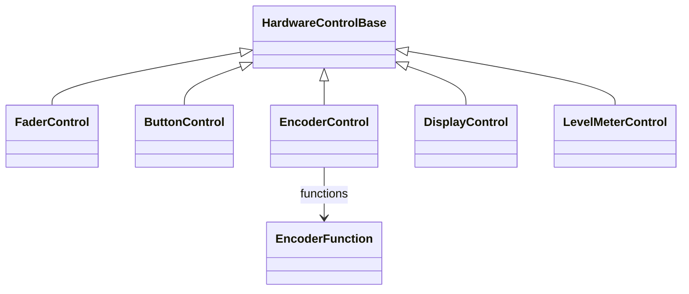
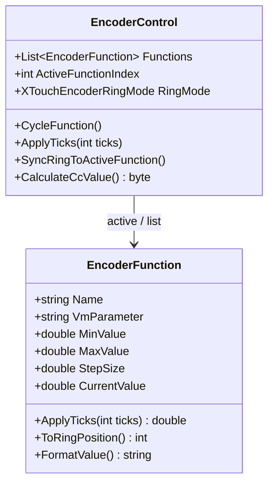
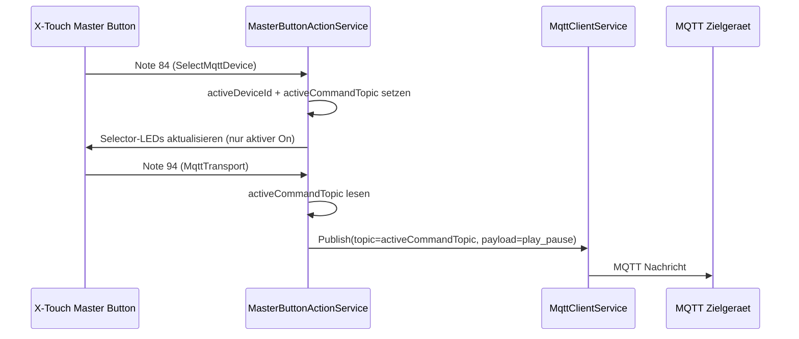

[English](ARCHITECTURE.md) | [Deutsch](ARCHITECTURE-DE.md)

# Architecture & Extensibility

## Overview
```mermaid
flowchart TD
    App[XTouchVMBridge.App (WPF)\nTrayIcon, LogWindow, MidiDebugWindow,\nXTouchPanelWindow, AudioDeviceMonitor,\nScreenLockDetector, MasterButtonActionService,\nSegmentDisplayService]

    DI[DI / Microsoft.Extensions.Hosting]
    Midi[XTouchVMBridge.Midi\nXTouchDevice, MackieProtocol, MidiDecoder]
    VM[XTouchVMBridge.Voicemeeter\nVoicemeeterBridge, VoicemeeterService,\nConfigurationService, Native P/Invoke]
    Core[XTouchVMBridge.Core\nEnums, Models, Interfaces,\nHardware Controls, Events]

    App --> DI
    DI --> Midi
    DI --> VM
    DI --> Core
```
## Dependencies between projects
```mermaid
flowchart LR
    Core[XTouchVMBridge.Core\n(Foundation)]
    Midi[XTouchVMBridge.Midi]
    VM[XTouchVMBridge.Voicemeeter]
    App[XTouchVMBridge.App]
    Tests[XTouchVMBridge.Tests]

    Core --> Midi
    Core --> VM
    Core --> App
    Core --> Tests
    Midi --> App
    Midi --> Tests
    VM --> App
    VM --> Tests
```

The direction is always "downward": App knows everything, Core knows nobody.
Midi and Voicemeeter do not know each other - the connection runs via interfaces from Core.

## Dependency Injection

All services are registered in `App.xaml.cs`:
```csharp
services.AddSingleton<IMidiDevice, XTouchDevice>();    // Core-Interface → Midi-Implementierung
services.AddSingleton<IVoicemeeterService, VoicemeeterService>();
services.AddSingleton<IScreenLockDetector, ScreenLockDetector>();
services.AddHostedService<AudioDeviceMonitorService>(); // Hintergrund-Thread + X-Touch Reconnect
services.AddHostedService<VoicemeeterBridge>();          // 100ms Polling-Loop
services.AddSingleton<MasterButtonActionService>();      // Master-Button -> Programm/Keys/Text/VM/MQTT
services.AddHostedService<SegmentDisplayService>();      // 7-Segment-Display (Uhrzeit etc.)
services.AddSingleton<MqttClientService>();              // MQTT Client (connect/publish/subscribe)
services.AddHostedService(sp => sp.GetRequiredService<MqttClientService>());
services.AddSingleton<MqttButtonIntegrationService>();   // MQTT <-> Button Mapping/LEDs
services.AddSingleton<TrayIconService>();
```
To use another MIDI device: write your own class that implements `IMidiDevice`,
and exchange in the DI registry.

## Hardware controls hierarchy


Each control type knows its channel index and a unique `ControlId`.
All controls of a channel are bundled in `XTouchChannel`.

### Encoder function list


Each function remembers its own value - the state is retained when switching.

### Encoder display behavior

When pressing/turning the encoder (hardware) or Ctrl+click/mouse wheel (panel):
- **Top display line**: Shows the parameter name (e.g. "HIGH", "MID", "PAN")
- **Bottom display line**: Shows the current value (e.g. "0.0dB", "-3.5dB")
- **After 5 seconds**: Automatically switches back to channel name (top) and view name (bottom)

### Panel encoder control

In the X-Touch panel, encoders can be operated entirely using the mouse:
- **Ctrl+Click**: Calls `encoder.CycleFunction()` (identical to hardware press)
- **Mouse Wheel**: Calls `encoder.ApplyTicks(±1)` (identical to hardware rotation)
- **Ctrl+Mouse Wheel**: `ApplyTicks(±5)` for rough control
- Current value is read from Voicemeeter and written back after change
- Ring position, display text and hardware are synchronized

### Encoder LED ring synchronization

The encoder rings are automatically synchronized with every parameter update (`UpdateParameters()`):
- Reads the current value from Voicemeeter
- Calculates ring position based on min/max
- Sends the correct CC value to the X-Touch

---

## Add new hardware control

### Example: Jog Wheel

The X-Touch has a jog wheel (CC 88, CW=65, CCW=1), which is currently not modeled as a control.

#### 1. New control in `XTouchVMBridge.Core/Hardware/`
```csharp
// XTouchVMBridge.Core/Hardware/JogWheelControl.cs
namespace XTouchVMBridge.Core.Hardware;

public class JogWheelControl : HardwareControlBase
{
    public JogWheelControl() : base(0, "JogWheel") { }

    /// <summary>Letzte Drehrichtung: +1 CW, -1 CCW, 0 idle.</summary>
    public int LastDirection { get; set; }
}
```
#### 2nd event in `XTouchVMBridge.Core/Events/`
```csharp
// XTouchVMBridge.Core/Events/JogWheelEventArgs.cs
namespace XTouchVMBridge.Core.Events;

public class JogWheelEventArgs : EventArgs
{
    /// <summary>+1 = CW (rechts), -1 = CCW (links).</summary>
    public int Direction { get; }
    public JogWheelEventArgs(int direction) => Direction = direction;
}
```
#### 3. Add event to `IMidiDevice` interface
```csharp
// In XTouchVMBridge.Core/Interfaces/IMidiDevice.cs:
event EventHandler<JogWheelEventArgs>? JogWheelTurned;
```
#### 4. Implement in `XTouchDevice`
```csharp
// In XTouchVMBridge.Midi/XTouch/XTouchDevice.cs:
// 1. Event deklarieren:
public event EventHandler<JogWheelEventArgs>? JogWheelTurned;

// 2. Im HandleEncoder-Switch-Case für CC 88:
private void HandleEncoder(byte cc, byte value)
{
    // Jog Wheel: CC 88
    if (cc == 88)
    {
        int direction = value == 65 ? 1 : value == 1 ? -1 : 0;
        JogWheelTurned?.Invoke(this, new JogWheelEventArgs(direction));
        return;
    }
    // ... bestehender Encoder-Code
}
```
#### 5. Use in `VoicemeeterBridge`
```csharp
// In XTouchVMBridge.Voicemeeter/Services/VoicemeeterBridge.cs:
_xtouch.JogWheelTurned += (_, e) =>
{
    // z.B. Master-Volume anpassen
    _logger.LogDebug("Jog Wheel: {Direction}", e.Direction);
};
```
---

## Add new button type

### Example: Fifth button type “Assign”

If the X-Touch is expanded to include an additional button type:

#### 1. Expand Enum
```csharp
// XTouchVMBridge.Core/Enums/XTouchButtonType.cs
public enum XTouchButtonType : byte
{
    Rec = 0,
    Solo = 1,
    Mute = 2,
    Select = 3,
    Assign = 4     // NEU
}
```
That's it for code change. `XTouchChannel` automatically creates a `ButtonControl` for all enum values:
```csharp
// In XTouchChannel constructor (bereits vorhanden):
foreach (var buttonType in Enum.GetValues<XTouchButtonType>())
{
    buttons[buttonType] = new ButtonControl(index, buttonType);
}
```
The MIDI note number is calculated automatically: `NoteNumber = (int)buttonType * 8 + channel`.
For Assign this would be Note 32-39 (currently Encoder Press — check collision!).

If the grade calculation needs to be different, adjust the formula in `ButtonControl`:
```csharp
// XTouchVMBridge.Core/Hardware/ButtonControl.cs
NoteNumber = buttonType == XTouchButtonType.Assign
    ? 40 + channel   // eigene Note-Range
    : (int)buttonType * 8 + channel;
```
---

## Add new encoder function

### Example: Denoiser strength as an encoder function

To add a new controllable function to an encoder:

#### 1. Add to `VoicemeeterBridge.RegisterEncoderFunctions()`
```csharp
// Bestehende Funktionen für einen Encoder:
encoder.AddFunctions(new[]
{
    new EncoderFunction("HIGH", $"Strip[{vmCh}].EQGain3", -12, 12, 0.5, "dB"),
    new EncoderFunction("MID",  $"Strip[{vmCh}].EQGain2", -12, 12, 0.5, "dB"),
    new EncoderFunction("LOW",  $"Strip[{vmCh}].EQGain1", -12, 12, 0.5, "dB"),
    // NEU: Denoiser-Stärke
    new EncoderFunction("DENOI", $"Strip[{vmCh}].Denoiser", 0, 10, 0.5, ""),
});
```
The new function can be accessed immediately by pressing the encoder.
The display shows the value and the encoder ring shows the position.

#### 2. Optional: Own EncoderFunction subclass

For functions with special behavior (e.g. non-linear mapping):
```csharp
public class LogarithmicEncoderFunction : EncoderFunction
{
    public LogarithmicEncoderFunction(string name, string vmParam)
        : base(name, vmParam, 20, 20000, 1, "Hz") { }

    // Ring-Position logarithmisch berechnen
    public new int ToRingPosition()
    {
        double logNorm = Math.Log(CurrentValue / MinValue) / Math.Log(MaxValue / MinValue);
        return (int)Math.Round(logNorm * 15);
    }
}
```
---

## Add new encoder ring mode
```csharp
// XTouchVMBridge.Core/Enums/XTouchEncoderRingMode.cs
public enum XTouchEncoderRingMode : byte
{
    Dot = 0,
    Pan = 1,
    Wrap = 2,
    Spread = 3,
    // CustomMode = 4  ← Hier ergänzen
}
```
### X-Touch Encoder LED ring mapping (empirically determined)

The X-Touch has 13 LEDs per encoder ring: L6 L5 L4 L3 L2 L1 [M] R1 R2 R3 R4 R5 R6

The CC values (CC 48-55) are interpreted as follows:

| Mode | CC area | Usable values ​​| Description |
|-------|-----------|----------------|--------------|
| Dot (0) | 1-11 | 11 positions | Single LED (L5..M..R5) |
| Pan (1) | 17-27 | 11 positions | Filling from the middle (for EQ: -12dB..0..+12dB) |
| Wrap (2) | 33-43 | 11 positions | Filling from the left (for gain: 0..100%) |
| Spread (3) | 49-54 | 6 positions | Symmetrical from center |

**+64 to each value**: Additionally switches on L6 and R6 (outer LEDs).

#### Full CC value → LED assignment (without +64)

**Mode 0 (Dot) - Single LED:**
| Value | LEDs |
|------|------|
| 0 | - (off) |
| 1 | L5 |
| 2 | L4 |
| 3 | L3 |
| 4 | L2 |
| 5 | L1 |
| 6 | M |
| 7 | R1 |
| 8 | R2 |
| 9 | R3 |
| 10 | R4 |
| 11 | R5 |

**Mode 1 (Pan) - Filling from the center:**
| Value | LEDs |
|------|------|
| 17 | L5 L4 L3 L2 L1 M |
| 18 | L4 L3 L2 L1 M |
| 19 | L3 L2 L1 M |
| 20 | L2 L1 M |
| 21 | L1 M |
| 22 | M |
| 23 | M R1 |
| 24 | M R1 R2 |
| 25 | M R1 R2 R3 |
| 26 | M R1 R2 R3 R4 |
| 27 | M R1 R2 R3 R4 R5 |

**Mode 2 (Wrap) - Filling from the left:**
| Value | LEDs |
|------|------|
| 33 | L5 |
| 34 | L5 L4 |
| 35 | L5 L4 L3 |
| 36 | L5 L4 L3 L2 |
| 37 | L5 L4 L3 L2 L1 |
| 38 | L5 L4 L3 L2 L1 M |
| 39 | L5 L4 L3 L2 L1 M R1 |
| 40 | L5 L4 L3 L2 L1 M R1 R2 |
| 41 | L5 L4 L3 L2 L1 M R1 R2 R3 |
| 42 | L5 L4 L3 L2 L1 M R1 R2 R3 R4 |
| 43 | L5 L4 L3 L2 L1 M R1 R2 R3 R4 R5 |

**Mode 3 (Spread) - Symmetrical from center:**
| Value | LEDs |
|------|------|
| 49 | M |
| 50 | L1 M R1 |
| 51 | L2 L1 M R1 R2 |
| 52 | L3 L2 L1 M R1 R2 R3 |
| 53 | L4 L3 L2 L1 M R1 R2 R3 R4 |
| 54 | L5 L4 L3 L2 L1 M R1 R2 R3 R4 R5 |

**With +64 (L6 and R6 also on):**
All of the above values + 64 also turn on the outer LEDs L6 and R6.
Example: Value 86 (= 22 + 64) = L6 M R6

The calculation in `EncoderControl.CalculateCcValue()`:
```csharp
case XTouchEncoderRingMode.Pan:
    baseValue = Math.Clamp(_ringPosition, 0, 10) + 17;  // Position 0-10 → Wert 17-27
    break;
```
---

## Add new channel view

Expand the `_channelViews` list in `VoicemeeterBridge`:
```csharp
private readonly List<ChannelView> _channelViews = new()
{
    new("Home",    new[] { 3, 4, 5, 6, 7, 9, 10, 12 }),
    new("Outputs", new[] { 8, 9, 10, 11, 12, 13, 14, 15 }),
    new("Inputs",  new[] { 0, 1, 2, 3, 4, 5, 6, 7 }),
    new("Custom",  new[] { 0, 3, 5, 7, 9, 11, 13, 15 }),  // NEU
};
```
The view is automatically accessible via encoder 1.

### Per-view display colors

Each channel view can define its own display color per strip, which overwrites the global channel color.
```csharp
// In ChannelViewConfig (Core/Models/ChannelViewConfig.cs):
public XTouchColor?[]? ChannelColors { get; set; }

public XTouchColor? GetChannelColor(int stripIndex)
{
    if (ChannelColors == null || stripIndex < 0 || stripIndex >= ChannelColors.Length)
        return null;
    return ChannelColors[stripIndex];
}
```
The color evaluation in `VoicemeeterBridge.UpdateDisplays()`:
```csharp
// View-Farbe hat Priorität vor globaler Kanalfarbe
var viewColor = ChannelViews[_currentViewIndex].GetChannelColor(xtCh);
if (viewColor.HasValue)
    colors[xtCh] = viewColor.Value;
else if (_config.Channels.TryGetValue(vmCh, out var chConfig))
    colors[xtCh] = chConfig.Color;
```
The Channel View Editor (`ChannelViewEditorDialog`) shows one color combo box per strip
with colored rectangle previews. `null` entries are represented as "—" (global color).

---

## Ctrl+click control in the X-Touch panel

The X-Touch Panel supports Ctrl+Click as direct control for all controls:

### Master buttons
```csharp
// OnMasterButtonClick: Strg+Klick → Aktion oder LED-Toggle
if (Keyboard.Modifiers.HasFlag(ModifierKeys.Control))
{
    // 1. Konfigurierte Aktion ausführen (z.B. Media-Keys)
    if (_masterButtonActionService?.ExecuteAction(noteNumber) == true)
        return;
    // 2. Fallback: LED toggeln (On/Off) + MIDI-Note ans X-Touch senden
    _masterButtonLedState.TryGetValue(noteNumber, out bool isOn);
    _masterButtonLedState[noteNumber] = !isOn;
    _device?.SetMasterButtonLed(noteNumber, !isOn ? LedState.On : LedState.Off);
    // PanelView-Button visuell aktualisieren (sender ist der WPF-Button)
    return;
}
```
`ExecuteAction()` returns `bool` — `true` when an action has been configured and executed.
Without a configured action, the LED is toggled (On/Off) instead of always being set to On.
The LED state is saved in `_masterButtonLedState` (Dictionary<int,bool>).

### Channel buttons (REC/SOLO/MUTE/SELECT)
```csharp
// OnHwButtonClick: Strg+Klick → VM-Parameter toggeln oder LED toggeln
if (Keyboard.Modifiers.HasFlag(ModifierKeys.Control))
{
    ExecuteHwButtonAction(ch, type);
    return;
}
```
`ExecuteHwButtonAction` checks whether a VM parameter is assigned:
- **Assigned** (e.g. mute, solo): toggle VM parameters (as before)
- **Not assigned** (e.g. Rec, Select): Toggle LED directly via `_manualLedState` Dictionary
```csharp
// Kein Mapping → LED manuell toggeln (Panel + Hardware)
if (!hasMapping)
{
    var key = (ch, type);
    _manualLedState.TryGetValue(key, out bool isOn);
    _manualLedState[key] = !isOn;
    _device.SetButtonLed(ch, type, !isOn ? LedState.On : LedState.Off);
}
```
`GetEffectiveLedState()` checks in `RefreshAll()` whether a manual state exists:
```csharp
private LedState GetEffectiveLedState(int ch, XTouchButtonType type, XTouchChannel xtCh)
{
    if (_manualLedState.TryGetValue((ch, type), out bool isOn))
        return isOn ? LedState.On : LedState.Off;
    return xtCh.GetButton(type).LedState;  // Fallback: Hardware-State
}
```
The VoicemeeterBridge no longer overwrites unassigned buttons to Off
(the else branch in `UpdateParameters()` was removed).

### Encoder (Ctrl+click+mouse wheel)
```csharp
// OnEncoderClick: Strg+Klick → nächste Funktion durchschalten
if (Keyboard.Modifiers.HasFlag(ModifierKeys.Control))
{
    var fn = encoder.CycleFunction();      // HIGH → MID → LOW → ...
    fn.CurrentValue = _vm.GetParameter(fn.VmParameter);  // Wert aus VM lesen
    encoder.SyncRingToActiveFunction();    // Ring-Position synchronisieren
    _device.SetEncoderRing(ch, ...);       // Hardware aktualisieren
    return;
}
```

```csharp
// OnEncoderMouseWheel: Mausrad → Wert ändern
int ticks = e.Delta > 0 ? 1 : -1;
if (Keyboard.Modifiers.HasFlag(ModifierKeys.Control))
    ticks *= 5;                            // Strg+Mausrad: 5× gröbere Schritte
var fn = encoder.ApplyTicks(ticks);        // Wert ändern (mit Clamping)
_vm.SetParameter(fn.VmParameter, (float)fn.CurrentValue);  // An VM senden
_device.SetEncoderRing(ch, ...);           // Ring aktualisieren
_device.SetDisplayText(ch, 0, fn.Name);    // Display: Funktionsname
_device.SetDisplayText(ch, 1, fn.FormatValue());  // Display: Wert
```
### Fader (Transparent Overlay Pattern)

WPF sliders with `IsEnabled = false` do not receive mouse events (not even preview/tunneling).
Solution: A transparent `Border` overlay over the slider in the same `Grid`:
```
Grid (faderHost)
├── Slider (IsEnabled=false, IsHitTestVisible=false)  ← visuell
└── Border (Background=Transparent, Cursor=Hand)       ← fängt Maus-Events
```

```csharp
var faderHost = new Grid { Width = 32, Height = 150 };
faderHost.Children.Add(fader);           // Slider (disabled, kein HitTest)

var faderOverlay = new Border { Background = Brushes.Transparent };
faderOverlay.MouseLeftButtonDown += (_, e) => OnFaderMouseDown(ch, e);
faderOverlay.MouseMove += (_, e) => OnFaderMouseMove(ch, e);
faderOverlay.MouseLeftButtonUp += (_, _) => OnFaderMouseUp(ch);
faderHost.Children.Add(faderOverlay);    // Overlay (empfängt Maus-Events)
```
When Ctrl+click, the mouse position is converted into a fader value (`SetFaderFromMousePosition`),
the slider value is set directly and the dB value is sent to Voicemeeter.
Mouse capture is on the overlay so that drag movements can also be tracked outside of it.
`RefreshAll()` skips the fader while `_draggingFaderChannel` is active.

---

## SetMasterButtonLed (MIDI output)

New method in `IMidiDevice` / `XTouchDevice` to send note-on to master section buttons:
```csharp
// IMidiDevice:
void SetMasterButtonLed(int noteNumber, LedState state);

// XTouchDevice:
public void SetMasterButtonLed(int noteNumber, LedState state)
{
    byte velocity = state switch { ... };
    SendShortMessage(0x90, (byte)noteNumber, velocity);
}
```
Used in the panel for Ctrl+click on unconfigured master buttons,
to toggle the LED and send the MIDI note to the device.
The toggle state is stored in `_masterButtonLedState` in the PanelView.

---

## Master button actions

Master section buttons (Notes 40+) fire the `MasterButtonChanged` event. The `MasterButtonActionService`
reacts to configured buttons and carries out the associated action.

Current MQTT related action types:
- `MqttPublish` (Press/Release Publish + optional LED via MQTT)
- `SelectMqttDevice` (select active target device, selector LED shows status)
- `MqttTransport` (send transport command to currently selected target device)

### MQTT Device Select -> Transport (Sequence)

### Add new action type

1. **Expand Enum** in `Core/Models/MasterButtonActionConfig.cs`:
```csharp
public enum MasterButtonActionType
{
    None, VmParameter, LaunchProgram, SendKeys, SendText,
    CycleChannelView, RestartAudioEngine, ShowVoicemeeter, LockGui, TriggerMacroButton,
    HttpRequest  // NEU
}
```
2. **Add config fields** in `MasterButtonActionConfig`:
```csharp
public string? HttpUrl { get; set; }
public string? HttpMethod { get; set; }
```
3. Add **Execute method** in `MasterButtonActionService.cs`:
```csharp
private async Task ExecuteHttpRequest(MasterButtonActionConfig config) { ... }
```
4. Call **In the switch case**:
```csharp
case MasterButtonActionType.HttpRequest:
    ExecuteHttpRequest(actionConfig);
    break;
```
5. **Editor** in `XTouchPanelWindow.MappingEditor.cs`:
   - Add ComboBox entry in `ShowMasterButtonMappingPanel()`
   - Insert sub-panel in `XTouchPanelWindow.xaml`
   - Control visibility in `UpdateMasterActionSubPanels()`
   - Save/load to `OnMasterActionSave()` / `OnMasterActionClear()`

### LED feedback

Each master button action has a configurable LED feedback mode:
```csharp
public enum LedFeedbackMode
{
    Blink,     // LED blinkt 150ms auf
    Toggle,    // LED wechselt An/Aus bei jedem Druck
    Blinking   // LED blinkt dauerhaft (Hardware-Blink via Mackie Protocol Velocity 2)
}
```
The `MasterButtonActionConfig` contains the field `LedFeedback` (default: `Blink`).
The `MasterButtonActionService` manages toggle/blink states in a `Dictionary<int, bool>`.
Blinking mode uses the Mackie Protocol's native hardware blinking (`LedState.Blink = 2`)
and requires no software timers — pressing it again toggle between flashing and off.

For `VmParameter` actions, there is an additional LED source option:

```csharp
public enum MasterVmLedSource
{
    ManualFeedback,  // LED follows ledFeedback
    VoicemeeterState // LED follows VM parameter state (On/Off)
}
```

When `vmLedSource = VoicemeeterState`, LED feedback mode is ignored for this button and
the LED is synchronized in the polling loop from the current Voicemeeter parameter value.

### Note numbers (Master Section)

| Section | Notes | Examples |
|---|---|---|
| Fader Bank | 46-47 | BANK LEFT=46, BANK RIGHT=47 (freely assignable) |
| Channel | 48-49 | CHANNEL LEFT=48, CHANNEL RIGHT=49 |
| Flip | 50 | **Hardcoded: Channel View Cycling** |
| Encoder Assign | 40-45 | TRACK=40, SEND=41, PAN=42, PLUG-IN=43, EQ=44, INST=45 |
| NAME/VALUE | 52-53 | NAME=52, VALUE=53 |
| Function Keys | 54-61 | F1=54, F2=55, ..., F8=61 |
| Global View | 62-69 | MIDI=62, INPUTS=63, AUDIO=64, ... |
| Transportation | 91-95 | REW=91, FF=92, STOP=93, PLAY=94, REC=95 |
| SMPTE/BEATS | 113-114 | SMPTE=113, BEATS=114 |

### Flip button for Channel View Cycling

The **Flip button (Note 50)** is reserved for switching through the channel views:
- Pressing switches to the next view (Home → Outputs → Inputs → ...)
- The LED flashes briefly to confirm
- When the view changes, the encoder functions are re-registered for the new channels

The Fader Bank Left/Right Buttons (Notes 46-47) can therefore be freely assigned for other actions.

---

## 7-segment display (SegmentDisplayService)

The `SegmentDisplayService` is a `BackgroundService` that controls the 12-digit 7-segment display.

### X-Touch 7-Segment Protocol

The X-Touch in MCU mode uses **Mackie Control CC messages** for the 7 segment display:

| CC | Digit position |
|----|----------------|
| 64 | Rightmost digit (12) |
| 65-74 | Digits 11-2 |
| 75 | Leftmost digit (1) |

**CC value format:**
- Bits 0-5: ASCII characters (lower 6 bits only)
- Bit 6 (0x40): Decimal point active

Example: `'5'` (ASCII 0x35) → CC value 0x35 & 0x3F = 0x35
Example with point: `'5.'` → CC value 0x35 | 0x40 = 0x75

The order is **right to left** — the first character in the string goes to CC 75 (left),
the last one at CC 64 (right).

### Add new display mode

1. **Expand Enum** in `SegmentDisplayService.cs`:
```csharp
public enum SegmentDisplayMode
{
    Time, Date, CpuUsage, Off,
    IpAddress  // NEU
}
```
2. Add **Format Method**:
```csharp
private static string FormatIpAddress()
{
    // Max 12 Zeichen, Punkte werden als Dots gerendert
    return "192.168.1.42";
}
```
3. Call **In the switch case**:
```csharp
SegmentDisplayMode.IpAddress => FormatIpAddress(),
```
The mode is automatically accessed using the cycle button.

### 7 segment font

The font in `MackieProtocol.SegmentFont` maps characters to segment bit patterns.
Supports: 0-9, A-F, H, J, L, P, S, U, Y, n, o, r, t, h, b, c, d, u, -, _, space, °.

Periods (`.`) and colons (`:`) in strings are automatically set as a dot on the previous digit.

---

## New MIDI message in the Debug Monitor

The `MidiMessageDecoder` decodes all messages. To add a new type:

1. Add a new case in `DecodeControlChange()` (for CC) or `DecodeNoteOn()` (for Notes).
2. The decoder always returns a `DecodedMidiMessage` record with all fields.
3. The `MidiDebugWindow` displays it automatically — no change necessary.
4. Add filter in XAML (new `ComboBoxItem` in `ControlTypeFilter`).

---

## Design patterns in the project

| Pattern | Where | Purpose |
|---|---|---|
| **Dependency Injection** | `App.xaml.cs` | All services interchangeable, testable |
| **BackgroundService** | `VoicemeeterBridge`, `AudioDeviceMonitorService`, `SegmentDisplayService` | Managed Threading with CancellationToken |
| **Observer (Events)** | `IMidiDevice` Events, `MasterButtonChanged`, `ConnectionStateChanged` | Decoupling MIDI input → business logic |
| **Strategy** | `ChannelView`, `ShortcutMode`, `EncoderFunction` | Switchable channel assignments / encoder functions |
| **State Cycling** | `EncoderControl.CycleFunction()` | Cyclic switching of encoder functions |
| **Factory** | `XTouchChannel` Constructor | Automatic button creation via Enum |
| **Adapter** | `VoicemeeterService` | Abstracts P/Invoke calls |
| **Template Method** | `HardwareControlBase` | Common basis for all controls |
| **Scheduler** | `TaskScheduler` (in Bridge) | Delayed actions (display reset) |
| **Transparent Overlay** | `XTouchPanelWindow` Faders | Intercept mouse events via deactivated WPF control |
| **Fallback Chain** | `OnMasterButtonClick` | Action → LED Toggle → Detail Panel |

## Voicemeeter API parameters

A complete reference of all Voicemeeter Remote API parameters -- implemented and still
expandable -- can be found in [VOICEMEETER-API.md](VOICEMEETER-API.md).

Documented there:
- All currently used parameters with file:line references
- All parameters that have not yet been implemented (Strip, Bus, Gate, Comp, Denoiser, FX, Routing, Modes)
- Recommended X-Touch mappings and implementation priority
- Step-by-step instructions for extension (EncoderFunction, button mapping)
- X-Touch capacity vs. used parameters (free REC/SELECT buttons)

---

## X-Touch MIDI protocol (empirically determined)

The X-Touch in **MCU mode** (Mackie Control Universal) uses the following protocols:

### SysEx prefix
```
Mackie Control Main:     F0 00 00 66 14 ...
Mackie Control Extended: F0 00 00 66 15 ...
```
The X-Touch (not extender) uses device ID **0x14** (MCU Main).

### Handshake (important for initialization)

A handshake must be sent when connecting:
```
F0 00 00 66 14 13 00 F7
```
Without this handshake, LCDs and other displays may not respond.

### Initialization (SendInitialization)

When connecting, all controls are set to a defined initial state:

1. **Handshake** (SysEx)
2. **Faders** in middle position
3. Delete **encoder rings** (CC 48-55 → 0)
4. **Channel button LEDs** off (Notes 0–31 → velocity 0)
5. **Master Section Button LEDs** off (Notes 40–103 → velocity 0)
6. **Display Colors** on White
7. **Delete display text**

Notes 32-39 (Encoder Press) and 104+ (Fader Touch) are not reset,
since these are only input events and have no LEDs.

### LCD displays (8 × 2 lines of 7 characters each)

**Mackie Control Format (works reliably):**
```
F0 00 00 66 14 12 [offset] [ASCII-Daten...] F7
```
- Offset 0-55: Top line (8 channels × 7 characters)
- Offset 56-111: Bottom line

**Display Colors:**
```
F0 00 00 66 14 72 [c0] [c1] [c2] [c3] [c4] [c5] [c6] [c7] F7
```
- Colors 0-7: Black, Red, Green, Yellow, Blue, Magenta, Cyan, White

### Encoder LED rings (CC 48-55)

See “X-Touch Encoder LED-Ring Mapping” section above.

### 7-segment display (CC 64-75)

See “X-Touch 7-Segment Protocol” section above.

### Level Meter (Channel Aftertouch)
```
D0 [channel << 4 | level]
```
- Channel: 0-7 (upper 4 bits)
- Level: 0-13 (lower 4 bits)

### Fader (pitch bend)
```
E[channel] [LSB] [MSB]
```
- 14-bit value, signed: -8192 to +8191
- Channel 0-7: Strip fader, Channel 8: Main fader

### Test scripts

There are Python test scripts for protocol analysis in the project directory:
- `test_lcd.py` - LCD display tests
- `test_segment.py` - 7-segment display tests
- `test_encoder_ring.py` - Encoder LED ring tests

These scripts require `mido` and help debug MIDI communications.

---

## NuGet dependencies

| Package | Project | Purpose |
|---|---|---|
| NAudio 2.2.1 | Midi, App | MIDI I/O, audio device enumeration |
| Hardcodet.NotifyIcon.Wpf 1.1.0 | App | System tray icon |
| InputSimulatorCore 1.0.5 | App | Keyboard simulation (SendKeys, SendText) |
| Microsoft.Extensions.Hosting 8.0.1 | App | DI, BackgroundService, Logging |
| Serilog + Sinks | App | Structured logging in file + console |
| Microsoft.Extensions.Logging.Abstractions | Midi, Voicemeeter | ILogger<T> Interface |
| Microsoft.Extensions.Hosting.Abstractions | Voicemeeter | BackgroundService |
